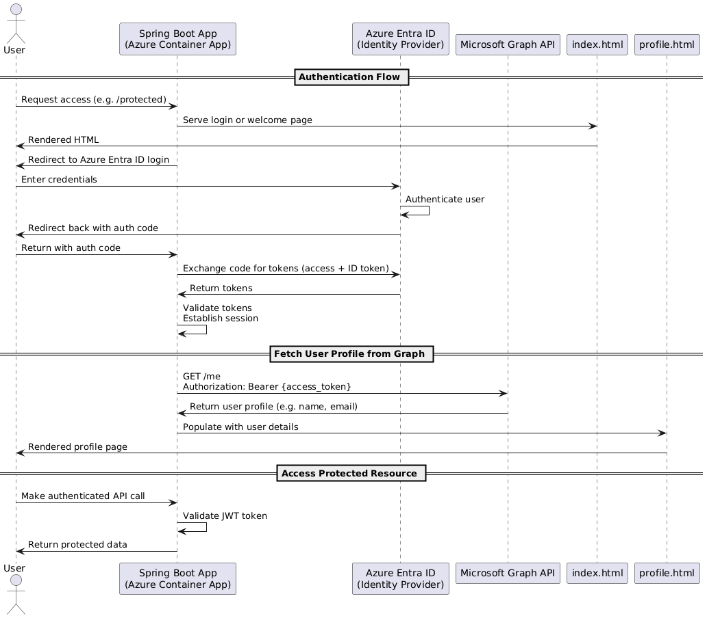

# Spring Boot Azure Container App with Entra ID

This project demonstrates how to build and deploy a Spring Boot application to Azure Container Apps with Azure Entra ID (formerly Azure Active Directory) integration for authentication and authorization.

## Authentication Flow

The UML diagram at the top of this README illustrates the authentication flow between the application and Azure Entra ID. Here's how it works:

1. **Initiating Authentication**: When a user clicks the "Login with Azure Entra ID" button (`<a th:href="@{/oauth2/authorization/azure}" class="btn btn-primary">Login with Azure Entra ID</a>`) in the index.html page, this triggers Spring Security's OAuth2 client mechanism.

2. **Redirection to Azure Entra ID**: Spring Security processes the `/oauth2/authorization/azure` path (standard OAuth2 client path where "azure" is the registration ID), and redirects the user to Azure Entra ID's authorization endpoint configured in the application.yml.

3. **Azure Authentication**: The user authenticates with their Azure Entra ID credentials directly on Microsoft's authentication page.

4. **Token Issuance**: After successful authentication, Azure Entra ID issues an authorization code and redirects back to the application's configured redirect URI (`/login/oauth2/code/azure`).

5. **Token Exchange**: Spring Security exchanges this authorization code for access and ID tokens by calling Azure Entra ID's token endpoint.

6. **User Session Creation**: Spring Security creates a user session using the received tokens and populates the SecurityContext with the authenticated user details.

7. **Redirection to Success URL**: The user is redirected to the `/profile` page as specified in the `defaultSuccessUrl("/profile", true)` setting in SecurityConfig.java.

8. **Protected Resources Access**: For subsequent requests to protected resources or Microsoft Graph API, the UserService uses the stored tokens to authorize requests.

This OAuth2 flow is entirely managed by Spring Security's OAuth2 client support, with the configuration defined in application.yml and SecurityConfig.java. No custom code is needed to handle the basic authentication flow.

## Features

- Spring Boot 3 application with Spring Security
- Azure Entra ID integration for user authentication
- OAuth2 Resource Server configuration for secure API endpoints
- Containerized with Docker for deployment to Azure Container Apps
- Azure Container Apps configuration for deployment
- Thymeleaf templates for frontend rendering

## Prerequisites

- [Java 21+](https://adoptium.net/)
- [Maven](https://maven.apache.org/download.cgi)
- [Docker](https://www.docker.com/products/docker-desktop)
- [Azure CLI](https://docs.microsoft.com/en-us/cli/azure/install-azure-cli)
- An Azure subscription
- An Azure Entra ID tenant with admin access

## Deployment Summary

### Deployment Details
- Azure Container Registry: `{acr-name}.azurecr.io`
- Azure Container App Name: `spring-azure-container-app`
- Resource Group: `{resource-group-name}`
- Container App Environment: `{container-app-env-name}`
- Azure Entra ID Application ID: `{application-id}`
- Redirect URI: `https://{your-app}.azurecontainerapps.io/login/oauth2/code/azure`

### Deployment Process

The application was deployed using the following steps:

1. Built the Spring Boot application using Maven:
   ```bash
   mvn clean package
   ```

2. Built the Docker image using the provided Dockerfile:
   ```bash
   docker build -t {acr-name}.azurecr.io/spring-azure-container-app:latest .
   ```

3. Pushed the Docker image to Azure Container Registry:
   ```bash
   az acr login --name {acr-name}
   docker push {acr-name}.azurecr.io/spring-azure-container-app:latest
   ```

4. Created and deployed the Azure Container App using the configuration in `azure-container-app.yaml`:
   ```bash
   az containerapp create --resource-group {resource-group-name} --name spring-azure-container-app --yaml azure-container-app.yaml
   ```

5. Updated the redirect URI in Azure Entra ID application registration to fix authentication issues:
   ```bash
   az ad app update --id {application-id} --web-redirect-uris https://{your-app}.azurecontainerapps.io/login/oauth2/code/azure
   ```

### Common Issues and Resolutions

#### Redirect URI Mismatch Error

If you encounter the following error:
```
AADSTS50011: The redirect URI specified in the request does not match the redirect URIs configured for the application
```

Run the provided `fix-redirect-uri.bat` script after updating it with your Container App URL:
```bash
.\fix-redirect-uri.bat
```

The script updates your Azure Entra ID application with the correct redirect URI for your deployed Container App.

## Setup Azure Entra ID

### Option 1: Automated Setup (Recommended)

The project includes scripts to automatically create the necessary Azure Entra ID app registration:

#### For Windows:

```powershell
# Run the PowerShell script
./Create-AzureEntraAppRegistration.ps1 -AppName "spring-azure-container-app"

# If you want to specify a production redirect URI as well
./Create-AzureEntraAppRegistration.ps1 -AppName "spring-azure-container-app" -RedirectUriProduction "https://{your-app}.azurecontainerapps.io/login/oauth2/code/azure"
```

#### For Linux/macOS:

```bash
# Make the script executable
chmod +x create-azure-entra-app-registration.sh

# Run the script
./create-azure-entra-app-registration.sh --app-name "spring-azure-container-app"

# If you want to specify a production redirect URI as well
./create-azure-entra-app-registration.sh --app-name "spring-azure-container-app" --redirect-uri-production "https://{your-app}.azurecontainerapps.io/login/oauth2/code/azure"
```

The script will:
1. Create a new application registration in your Azure Entra ID tenant
2. Configure redirect URIs for local and (optionally) production environments
3. Enable ID token issuance
4. Add required Microsoft Graph API permissions
5. Grant admin consent for the permissions
6. Create a client secret for the application
7. Output the configuration values needed for your application

### Option 2: Manual Setup

1. Register a new application in Azure Entra ID:
   - Navigate to Azure Portal → Azure Entra ID → App registrations → New registration
   - Name: `spring-azure-container-app`
   - Supported account types: Accounts in this organizational directory only
   - Redirect URI: `http://localhost:8080/login/oauth2/code/azure` (for local testing)
   - Click Register

2. Create a client secret:
   - Navigate to your app registration → Certificates & secrets → Client secrets → New client secret
   - Add a description and select an expiration period
   - Copy the secret value (you'll need it later)

3. Configure API permissions:
   - Navigate to your app registration → API permissions → Add a permission
   - Select Microsoft Graph → Delegated permissions
   - Select the following permissions:
     - `User.Read`
     - `profile`
     - `email`
     - `openid`
   - Click "Add permissions"
   - Click "Grant admin consent for [your directory]"

4. Enable ID tokens:
   - Navigate to your app registration → Authentication
   - Under "Implicit grant and hybrid flows", check "ID tokens"
   - Click Save

## Troubleshooting Authentication Issues

If you encounter authentication issues such as "500 Internal Server Error" or "AADSTS500113: No reply address is registered for the application", follow these steps:

### Fix Redirect URI Registration

1. Create a batch file named `fix-redirect-uri.bat` with the following content:
   ```batch
   @echo off
   REM Fix Azure Entra ID redirect URI registration

   echo Setting up variables...
   set APP_ID={your-client-id}
   set REDIRECT_URI=http://localhost:8080/login/oauth2/code/azure

   echo Logging in to Azure...
   echo You may need to sign in with your Microsoft account in the browser window that opens

   REM Login to Azure
   call az login

   echo Updating app registration with redirect URI...
   call az ad app update --id %APP_ID% --web-redirect-uris %REDIRECT_URI%

   echo Verifying the update...
   call az ad app show --id %APP_ID% --query "web.redirectUris" -o tsv

   echo Setting environment variables for the application...
   set AZURE_CLIENT_ID=%APP_ID%
   set AZURE_CLIENT_SECRET={your-client-secret}
   set AZURE_TENANT_ID={your-tenant-id}

   echo Azure environment variables set:
   echo AZURE_CLIENT_ID=%AZURE_CLIENT_ID%
   echo AZURE_CLIENT_SECRET=[HIDDEN]
   echo AZURE_TENANT_ID=%AZURE_TENANT_ID%

   echo Running the application...
   call mvn spring-boot:run

   pause
   ```

2. Replace the placeholders:
   - `{your-client-id}` with your Azure Entra ID application client ID
   - `{your-client-secret}` with your application client secret
   - `{your-tenant-id}` with your Azure tenant ID

3. Run the batch file: 
   ```
   fix-redirect-uri.bat
   ```

### Fix Environment Variables

If you're having issues with environment variables not being properly set, create a `run-with-azure-vars.bat` file:

```batch
@echo off
REM Setting Azure Entra ID environment variables
set AZURE_CLIENT_ID={your-client-id}
set AZURE_CLIENT_SECRET={your-client-secret}
set AZURE_TENANT_ID={your-tenant-id}

REM Display the variables to confirm they're set
echo Azure environment variables set:
echo AZURE_CLIENT_ID=%AZURE_CLIENT_ID%
echo AZURE_CLIENT_SECRET=[HIDDEN]
echo AZURE_TENANT_ID=%AZURE_TENANT_ID%

REM Run the application with Maven
mvn spring-boot:run

REM Keep the window open to see any messages
pause
```

## Local Development

### Option 1: Using Template Files (Recommended)

The project includes template files that should be copied and filled with your credentials:

1. Copy the template files and remove the `.template` extension:
   ```batch
   copy azure-container-app.yaml.template azure-container-app.yaml
   copy set-azure-env.template.bat set-azure-env.bat
   copy src\main\resources\application.yml.template src\main\resources\application.yml
   ```

2. Edit each file to add your Azure Entra ID credentials:
   - `azure-container-app.yaml`: Update with your client ID, secret, and tenant ID
   - `set-azure-env.bat`: Fill in your Azure credentials 
   - `src\main\resources\application.yml`: Configure your Azure authentication settings

3. Run the application using the batch file:
   ```batch
   set-azure-env.bat
   ```
   
   This will set the necessary environment variables and start the application.

### Option 2: Run with Environment Variables

1. Set the environment variables in your terminal:
   
   **Windows Command Prompt:**
   ```batch
   set AZURE_CLIENT_ID=your-client-id
   set AZURE_CLIENT_SECRET=your-client-secret
   set AZURE_TENANT_ID=your-tenant-id
   ```
   
   **PowerShell:**
   ```powershell
   $env:AZURE_CLIENT_ID="your-client-id"
   $env:AZURE_CLIENT_SECRET="your-client-secret"
   $env:AZURE_TENANT_ID="your-tenant-id"
   ```
   
   **Linux/macOS:**
   ```bash
   export AZURE_CLIENT_ID=your-client-id
   export AZURE_CLIENT_SECRET=your-client-secret
   export AZURE_TENANT_ID=your-tenant-id
   ```

2. Run the application:
   ```
   mvn spring-boot:run
   ```

### Option 2: Run with Batch File (Windows)

1. Use the provided `run-with-azure-vars.bat` file:
   ```
   run-with-azure-vars.bat
   ```

### Option 3: Use Docker Compose

```bash
# Update docker-compose.yml with your Azure Entra ID credentials
docker-compose up --build
```

## Quick Start Guide

1. Create the Azure Entra ID app registration (if not already done):
   ```
   .\Create-AzureEntraAppRegistration.ps1 -AppName "spring-azure-container-app"
   ```

2. Note the output values for:
   - Client ID
   - Client Secret
   - Tenant ID

3. Update and run the `run-with-azure-vars.bat` file with these values.

4. Access the application at [http://localhost:8080](http://localhost:8080).

5. If you encounter a "No reply address is registered" error, run the `fix-redirect-uri.bat` script.

## Deployment to Azure

### Option 1: Using Azure Container App YAML Configuration (Recommended)

1. Prepare your `azure-container-app.yaml` file with your Azure resource details:
   ```yaml
   properties:
     managedEnvironmentId: "/subscriptions/{subscription-id}/resourceGroups/{resource-group}/providers/Microsoft.App/managedEnvironments/{environment-name}"
     configuration:
       ingress:
         external: true
         targetPort: 8080
         allowInsecure: false
         traffic:
           - latestRevision: true
             weight: 100
       registries:
         - server: "{acr-name}.azurecr.io"
           username: "{acr-username}"
           passwordSecretRef: "acr-password"
       secrets:
         - name: "acr-password"
           value: "{acr-password}"
         - name: "azure-client-id"
           value: "{client-id}"
         - name: "azure-client-secret"
           value: "{client-secret}" 
         - name: "azure-tenant-id"
           value: "{tenant-id}"
     template:
       containers:
         - image: "{acr-name}.azurecr.io/spring-azure-container-app:latest"
           name: spring-azure-container-app
           env:
             - name: "AZURE_CLIENT_ID"
               secretRef: "azure-client-id"
             - name: "AZURE_CLIENT_SECRET"
               secretRef: "azure-client-secret"
             - name: "AZURE_TENANT_ID"
               secretRef: "azure-tenant-id"
           resources:
             cpu: 0.5
             memory: "1Gi"
   ```

2. Replace all placeholder values with your actual Azure details:
   - `{subscription-id}`: Your Azure subscription ID
   - `{resource-group}`: Your resource group name
   - `{environment-name}`: Your Container Apps environment name
   - `{acr-name}`: Your Azure Container Registry name
   - `{acr-username}`: Your ACR username
   - `{acr-password}`: Your ACR password
   - `{client-id}`: Your Azure Entra ID application client ID
   - `{client-secret}`: Your client secret
   - `{tenant-id}`: Your Azure tenant ID

3. Deploy using the YAML configuration:
   ```bash
   az containerapp create --resource-group <resource-group> --name spring-azure-container-app --yaml azure-container-app.yaml
   ```

### Option 2: Using Azure CLI Commands

1. Log in to Azure:
   ```bash
   az login
   ```

2. Create an Azure Container Registry (ACR):
   ```bash
   az acr create --name <acr-name> --resource-group <resource-group> --sku Basic
   ```

3. Log in to ACR:
   ```bash
   az acr login --name <acr-name>
   ```

4. Build and push the Docker image:
   ```bash
   docker build -t <acr-name>.azurecr.io/spring-azure-container-app:latest .
   docker push <acr-name>.azurecr.io/spring-azure-container-app:latest
   ```

### Deploy to Azure Container Apps

1. Create an Azure Container Apps environment:
   ```bash
   az containerapp env create \
     --name <environment-name> \
     --resource-group <resource-group> \
     --location <location>
   ```

2. Create the Azure Container App:
   ```bash
   az containerapp create \
     --name spring-azure-container-app \
     --resource-group {resource-group} \
     --environment {environment-name} \
     --image {acr-name}.azurecr.io/spring-azure-container-app:latest \
     --target-port 8080 \
     --ingress external \
     --registry-server {acr-name}.azurecr.io \
     --registry-username {acr-username} \
     --registry-password {acr-password} \
     --env-vars AZURE_CLIENT_ID={client-id} AZURE_CLIENT_SECRET={client-secret} AZURE_TENANT_ID={tenant-id}
   ```

3. Update the redirect URI in your Azure Entra ID application registration to include your Container App URL:
   - Navigate to Azure Portal → Azure Entra ID → App registrations → Your app → Authentication
   - Add a new redirect URI: `https://{container-app-url}/login/oauth2/code/azure`
   - Click Save

## CI/CD with Azure Pipelines

The repository includes an `azure-pipelines.yml` file that can be used to set up Continuous Integration and Continuous Deployment with Azure Pipelines.

To use it:
1. Create a new pipeline in Azure DevOps
2. Connect to your repository
3. Select "Existing Azure Pipelines YAML file"
4. Configure the necessary pipeline variables:
   - `AZURE_SUBSCRIPTION`
   - `AZURE_CONTAINER_REGISTRY`
   - `RESOURCE_GROUP`
   - `CONTAINER_APP_ENV`
   - `CONTAINER_APP_NAME`

## Additional Resources

- [Azure Container Apps Documentation](https://learn.microsoft.com/azure/container-apps/)
- [Azure Entra ID Documentation](https://learn.microsoft.com/azure/active-directory/)
- [Spring Boot OAuth2 Documentation](https://docs.spring.io/spring-security/reference/servlet/oauth2/index.html)
- [Spring Boot Documentation](https://docs.spring.io/spring-boot/docs/current/reference/html/index.html)
